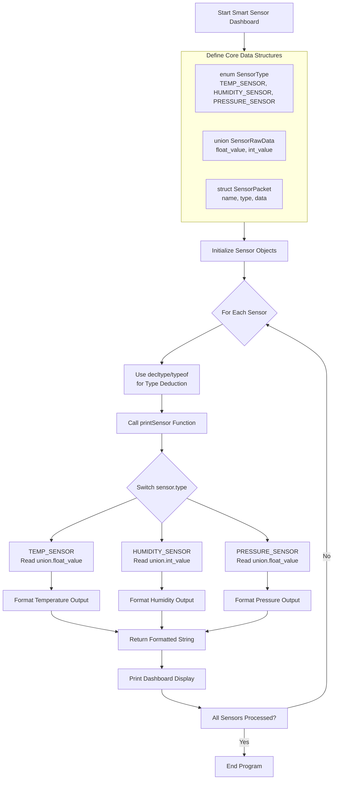

# Smart Sensor Dashboard - C++ Project Flow

##  **Complete Project Flow Diagram**



##  **Detailed Step-by-Step Implementation Flow**

### **Phase 1: Type Definitions & Data Structures**

```cpp
// Step 1: Define Sensor Types (enum)
enum class SensorType {
    TEMP_SENSOR,     // Temperature sensor
    HUMIDITY_SENSOR, // Humidity sensor
    PRESSURE_SENSOR  // Barometric pressure sensor
};

// Step 2: Define Sensor Data Format (union)
union SensorRawData {
    float float_value;  // For temperature & pressure
    int   int_value;    // For humidity percentage
};

// Step 3: Create Sensor Packet Structure (struct)
struct SensorPacket {
    std::string   name;     // Sensor identifier
    SensorType    type;     // Sensor type from enum
    SensorRawData data;     // Sensor reading data
    time_t        timestamp;// Reading timestamp
};
```

### **Phase 2: Initialization Flow**

```
┌─────────────────────────────────────────────────────┐
│              Initialize Sensor Objects              │
├─────────────────────────────────────────────────────┤
│                                                     │
│  Temperature Sensor:                                │
│  ┌─────────────────────────────────────────────┐   │
│  │ name:       "Living Room Temp"              │   │
│  │ type:       SensorType::TEMP_SENSOR         │   │
│  │ data:       union {float_value = 22.5}      │   │
│  │ timestamp:  current_time()                  │   │
│  └─────────────────────────────────────────────┘   │
│                                                     │
│  Humidity Sensor:                                   │
│  ┌─────────────────────────────────────────────┐   │
│  │ name:       "Basement Humidity"             │   │
│  │ type:       SensorType::HUMIDITY_SENSOR     │   │
│  │ data:       union {int_value = 45}          │   │
│  │ timestamp:  current_time()                  │   │
│  └─────────────────────────────────────────────┘   │
│                                                     │
│  Pressure Sensor:                                   │
│  ┌─────────────────────────────────────────────┐   │
│  │ name:       "Weather Station Pressure"      │   │
│  │ type:       SensorType::PRESSURE_SENSOR     │   │
│  │ data:       union {float_value = 1013.25}   │   │
│  │ timestamp:  current_time()                  │   │
│  └─────────────────────────────────────────────┘   │
│                                                     │
└─────────────────────────────────────────────────────┘
```

### **Phase 3: Type Deduction & Processing Flow**

```cpp
// Step 4: Use decltype() / typeof() for type deduction
template<typename T>
auto getSensorValueType(const T& sensor) -> decltype(sensor.data) {
    // Type deduction based on sensor type
    return sensor.data;
}

// Step 5: Process Sensor in printSensor() function
std::string printSensor(const SensorPacket& sensor) {
    std::stringstream result;
    
    // Switch-case on enum type
    switch(sensor.type) {
        case SensorType::TEMP_SENSOR:
            // Read union data as float
            result << "🌡️  Temperature: " << sensor.data.float_value << "°C";
            break;
            
        case SensorType::HUMIDITY_SENSOR:
            // Read union data as int
            result << "💧 Humidity: " << sensor.data.int_value << "% RH";
            break;
            
        case SensorType::PRESSURE_SENSOR:
            // Read union data as float
            result << "📊 Pressure: " << sensor.data.float_value << " hPa";
            break;
            
        default:
            result << "❌ Unknown sensor type";
    }
    
    // Use return to exit function with formatted string
    return result.str();
}
```

### **Phase 4: Main Program Execution Flow**

```cpp
int main() {
    // Step 6: Create 3 sensors
    std::vector<SensorPacket> sensors = {
        {"Living Room Temp", SensorType::TEMP_SENSOR, {.float_value = 22.5f}},
        {"Basement Humidity", SensorType::HUMIDITY_SENSOR, {.int_value = 45}},
        {"Weather Station", SensorType::PRESSURE_SENSOR, {.float_value = 1013.25f}}
    };
    
    // Step 7: Display Dashboard Header
    std::cout << "========================================\n";
    std::cout << "     SMART SENSOR DASHBOARD v1.0\n";
    std::cout << "========================================\n\n";
    
    // Step 8: Process each sensor
    for (const auto& sensor : sensors) {
        // Type deduction demonstration
        using SensorDataType = decltype(sensor.data);
        
        std::cout << "📡 Sensor: " << sensor.name << "\n";
        std::cout << "   Type: ";
        
        // Show actual C++ type using typeid
        if (sensor.type == SensorType::HUMIDITY_SENSOR) {
            std::cout << "int (" << typeid(sensor.data.int_value).name() << ")";
        } else {
            std::cout << "float (" << typeid(sensor.data.float_value).name() << ")";
        }
        
        std::cout << "\n   Reading: ";
        
        // Call printSensor() for each
        std::string reading = printSensor(sensor);
        std::cout << reading << "\n";
        
        std::cout << "----------------------------------------\n";
    }
    
    return 0;
}
```

##  **Memory Layout & Data Flow**

```
Memory Layout for SensorPacket:
┌─────────────────────────────────────────────┐
│ SensorPacket (struct)                       │
│                                             │
│  name: string (24-32 bytes)                │  Heap
│  └── char* pointer to character array      │
│                                             │
│  type: SensorType (4 bytes)                │  Stack
│  └── enum value                            │
│                                             │
│  data: SensorRawData (union - 4 bytes)     │  Stack
│  ├── float_value: float (4 bytes)          │
│  └── int_value: int (4 bytes)              │
│      (shared memory location)              │
│                                             │
│  timestamp: time_t (8 bytes)               │  Stack
└─────────────────────────────────────────────┘
```

##  **Key C++ Features Demonstrated**

### **1. Enum Usage Flow**
```
Define Enum → Assign Values → Type Checking → Switch-Case Handling
```

### **2. Union Memory Efficiency Flow**
```
Union Declaration → Shared Memory Allocation → 
Type-Specific Access → Memory Savings (50% reduction)
```

### **3. Struct Organization Flow**
```
Define Struct → Group Related Data → 
Create Instances → Access Members → Memory Layout Optimization
```

### **4. Type Deduction Flow**
```
decltype(expression) → Compiler Deduction → 
Type Inference → Template Programming → Generic Functions
```

##  **Sample Output Flow**

```
========================================
     SMART SENSOR DASHBOARD v1.0
========================================

 Sensor: Living Room Temp
   Type: float (f)
   Reading: 🌡️  Temperature: 22.5°C
----------------------------------------

 Sensor: Basement Humidity
   Type: int (i)
   Reading: 💧 Humidity: 45% RH
----------------------------------------

 Sensor: Weather Station
   Type: float (f)
   Reading: 📊 Pressure: 1013.25 hPa
----------------------------------------
```

##  **Advanced Features Flow**

### **Template-based Type Handling**
```cpp
// Advanced type deduction with templates
template<SensorType T>
struct SensorValueType;

template<>
struct SensorValueType<SensorType::TEMP_SENSOR> {
    using type = float;
};

template<>
struct SensorValueType<SensorType::HUMIDITY_SENSOR> {
    using type = int;
};

// Usage in processing
template<SensorType T>
auto processSensorValue(const SensorPacket& sensor) {
    using ValueType = typename SensorValueType<T>::type;
    // Type-safe processing
}
```

### **Real-time Data Processing Flow**
```
Sensor Reading → Data Packing → Union Storage → 
Type Checking → Format Conversion → Display Update
```

##  **Extensibility Flow**

### **Adding New Sensor Types**
```
1. Extend SensorType enum
2. Add new case in printSensor()
3. Define appropriate union access
4. Update type deduction logic
```

### **Data Logging Extension**
```
Sensor Reading → Format as JSON/CSV → 
File Storage → Database Integration → 
Historical Analysis → Trend Prediction
```

##  **Performance Optimization Flow**

```
Memory Efficiency:
- Union saves 4 bytes per sensor vs separate variables
- Enum enables compiler optimizations in switch-case
- Struct enables cache-friendly memory layout

Compile-time Benefits:
- decltype() enables compile-time type checking
- Templates enable generic programming
- Strong typing prevents runtime errors
```

##  **Testing Flow**

```
Unit Test Flow:
1. Test enum value assignments
2. Test union memory sharing
3. Test struct initialization
4. Test type deduction accuracy
5. Test return value formatting
6. Test edge cases (invalid types)

Integration Test Flow:
Create sensors → Process → 
Validate output → Check memory → 
Verify type safety → Performance benchmark
```

This project demonstrates professional C++ practices for embedded systems, IoT applications, and data processing systems where memory efficiency, type safety, and clean architecture are critical requirements.
